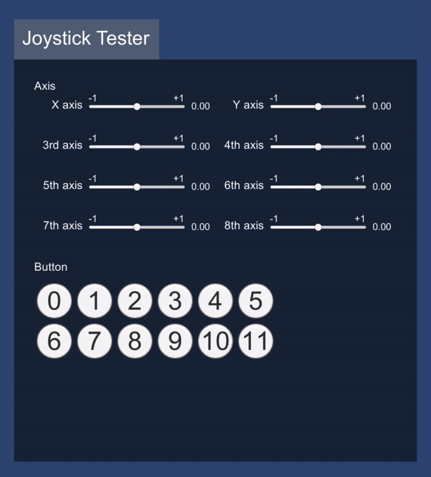
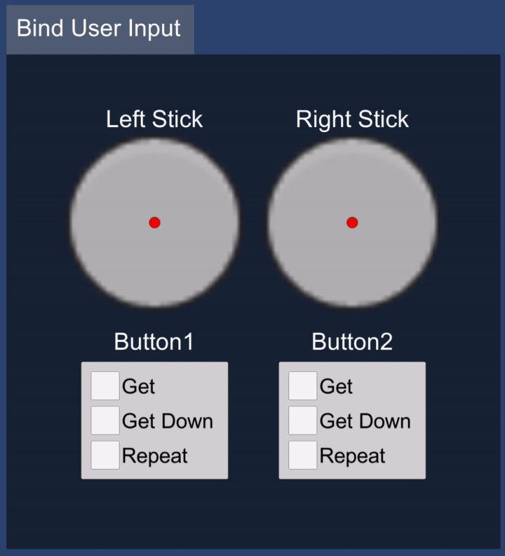

# user-input-sample

ユーザー入力に関するサンプルです。

## 開発環境

macOS Big Sur 11.5.2

Unity 2021.1.12f1

## JoystickTester

ゲームパッドの入力状態を可視化するサンプルです。

### 解説
- [ゲームパッドの入力判定 – Joystick Tester](https://heratta-lab.com/joystick-tester/)

## BindUserInput

UserInput を使ったサンプルです。ゲームパッドとキーボードの入力をバインドして一つの入力として扱う内容です。

### 解説
- [ユーザー入力のバインド – Bind User Input](https://heratta-lab.com/bind-user-input/)
